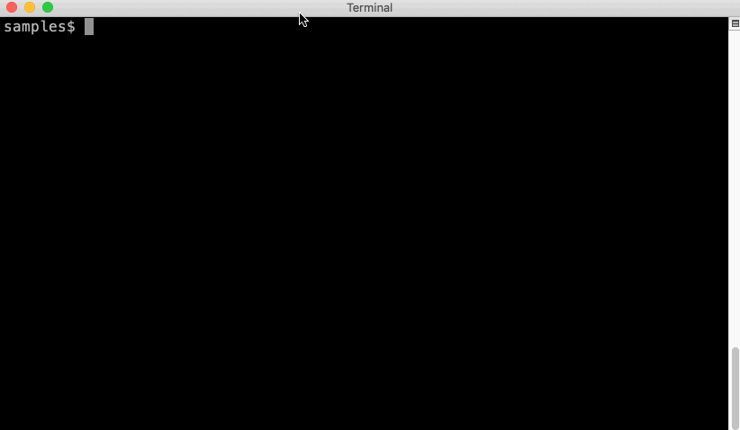

*****
Purdy
*****

During talks or screencasts I don't want to be typing code, it is too error
prone and too likely to mess up my speaking flow. **Purdy** is both a set of
programs and a library to display colourized code in a series of animations.

The ``purdy`` command takes one of a Python program, a Python REPL console file
or a Bash console file. Source code is presented to the screen as if typing.
For console files, the typing pauses at a prompt, waiting for interaction. 
Prompts are:  

* ``>>>`` or ``...`` for Python REPL
* ``$`` for Bash console

If the program is paused at a prompt, pressing the **right** arrow will
continue. Typing animation can be skipped over by pressing the letter "s"
instead. Animation can be undone by pressing the **left** arrow. More info on
keys can be found in the help dialog, viewed by pressing "?".

Example Usage:

.. code-block:: bash

    $ purdy code-snippet.py

The result looks like this:

Once the code has been displayed, further key presses are ignored. At any time
you can press "q" to quit.

Purdy Programs
##############

The following programs come with the `purdy` library:

* ``purdy`` -- Animated display that looks like a program is being typed to the
  screen.
* ``pat`` -- "purdy cat", prints ANSI colourized source.
* ``prat`` -- "purdy RTF cat", prints colourized source in RTF document format.
  Particularly useful for copying to a clipboard and pasting full colourized
  source into a document. On OS X `prat <filename> | pbcopy` will put the
  output directly to the clipboard.
* ``subpurdy`` -- Full set of commands to control Purdy. Sub-commands dictate 
  behaviour. Does a variety of code presentation. Includes ANSI, RTF, HTML
  output as well as the typewriter animations.

More information can be found in the Command Line Program Documentation.

Purdy TUI Controls
##################

The following keys help you to control the TUI purdy programs:

* ``?`` -- Help screen
* ``<RIGHT>`` -- next animation step
* ``<LEFT>`` -- previous animation step
* ``s`` -- go to the next step, skipping any animation

For custom made code using the purdy library, the following controls will also
work:

* ``S`` -- go to the next section, skipping any animation. 
* ``<TAB>`` -- focus next window area in a multi Screen display
* ``<SHIFT><TAB>`` -- focus previous window area in a multi Screen display

Additionally the ``s``, ``S``, and ``<LEFT>`` commands all support skipping
multiple steps by specifying a number first. For example the sequence ``12s``
would skip past the next 12 steps.

Purdy Library
#############

The ``purdy`` script is fairly simple. You can create more complex animations
by writing programs using the purdy library. Custom programs can have split
screens, highlighting lines, slide transitions and more.  More information can
be found in the Library Documentation.

Installation
############

.. code-block:: bash

    $ pip install purdy

Supports
########

Purdy has been tested with Python 3.8 through 3.12. Terminal control is done
with the `Urwid <http://urwid.org/>`_ library. Parsing and tokenization is
done through `Pygments <https://pygments.org/>`_. Both libraries are
execellent and I'm grateful they're publically available.

Docs & Source
#############

Docs: http://purdy.readthedocs.io/en/latest/

Source: https://github.com/cltrudeau/purdy
